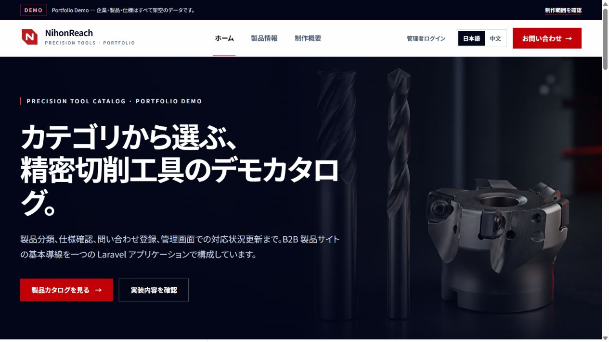
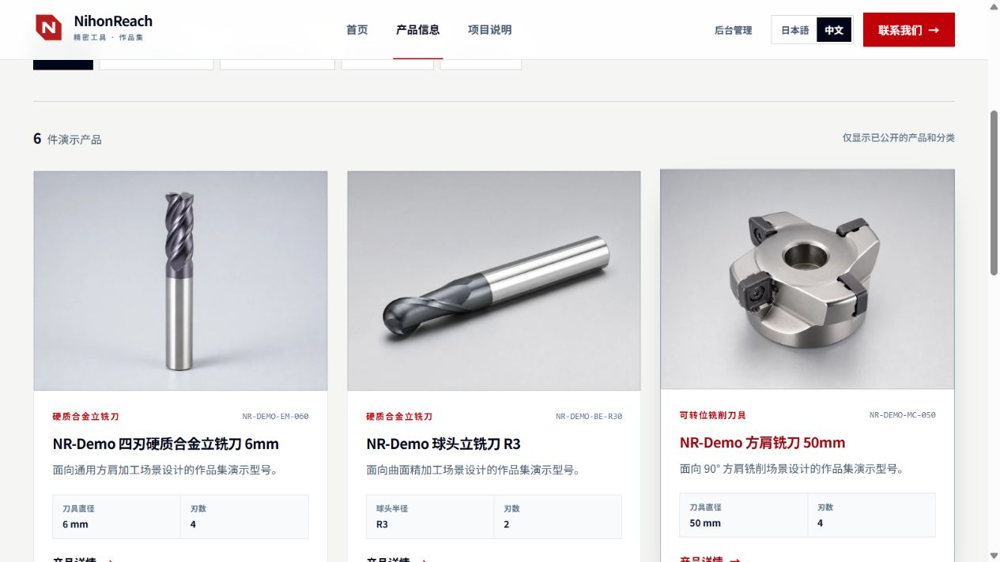
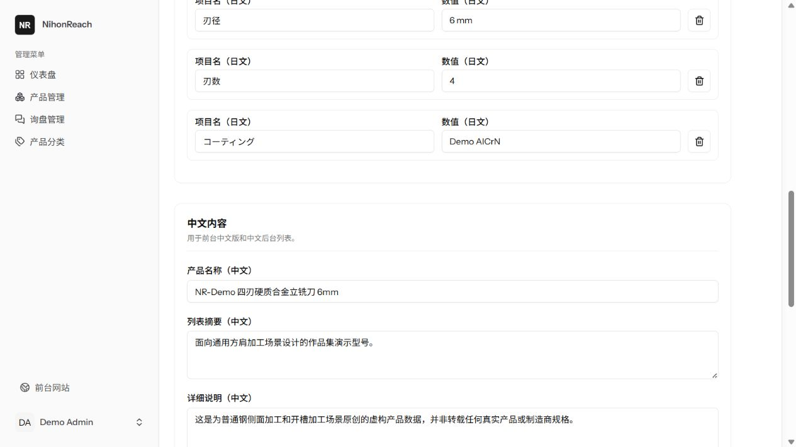
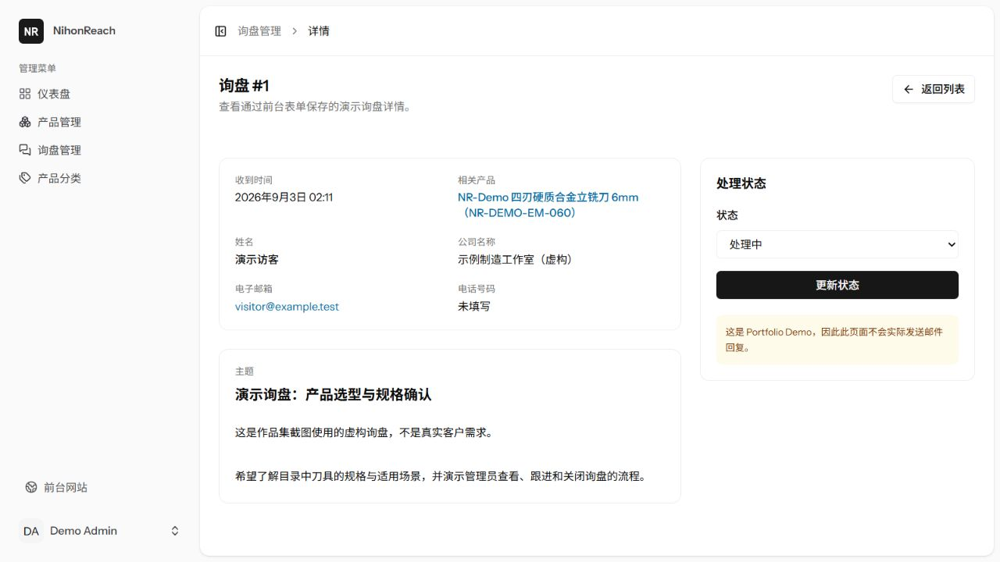
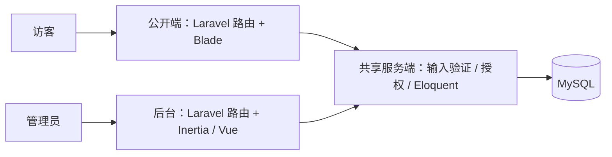

# NihonReach

NihonReach 是面向求职展示的精密切削工具 B2B Portfolio Demo，不是已商业运营的企业网站。项目已形成“公开产品浏览 → 提交询盘 → 管理员查看与更新状态”的完整演示闭环；所有企业、产品、规格和经营场景均为原创 Demo 数据。

## 在线演示与阅读入口

- [中文 Demo](https://nihonreach.kral-koharu.com/zh) · [日文 Demo](https://nihonreach.kral-koharu.com/)
- 技术栈：Laravel 13、Blade、Inertia 3、Vue 3、TypeScript、MySQL 8.4；Docker 多阶段镜像通过 Coolify 部署到个人 VPS，Cloudflare 管理 DNS。
- 部署状态：已完成首次部署、数据库迁移与 Demo 数据初始化，并由项目维护者完成人工功能验收。这是公开作品集演示，不代表商业运营、可用性承诺或备份恢复已验收。
- 管理后台不提供公开共享的可写账号；面试时可由维护者演示，或按下文启动本地环境体验。
- 建议先读 [业务路由](routes/web.php)、[产品管理与双语保存](app/Http/Controllers/Admin/ProductController.php)、[询盘验证](app/Http/Requests/Site/InquiryRequest.php) 和 [询盘测试](tests/Feature/Site/InquirySubmissionTest.php)。

## 界面速览

以下为本地运行中的真实界面截图，使用独立临时数据库和虚构数据；不是客户案例，也不包含生产后台或真实询盘。点击图片可查看原图。

| 日文首页 · Blade 公开站                                                               | 中文产品目录 · 产品卡片                                                                       |
| ------------------------------------------------------------------------------------- | --------------------------------------------------------------------------------------------- |
| [](docs/screenshots/ja-home.png) | [](docs/screenshots/zh-catalog.png) |

| 后台产品表单 · 中日文维护                                                                             | 询盘详情 · 状态更新                                                                                     |
| ----------------------------------------------------------------------------------------------------- | ------------------------------------------------------------------------------------------------------- |
| [](docs/screenshots/admin-product.png) | [](docs/screenshots/admin-inquiry.png) |

截图范围及数据说明见 [截图说明](docs/screenshots/README.md)。

## 架构速览



这是同一个 Laravel 单体应用的两个界面入口，不是两个独立服务。公开端以服务器渲染的目录为主，后台用 Vue 处理交互表单；输入验证、管理员授权与数据保存始终由 Laravel 执行，不依赖前端隐藏按钮来保护数据。

## 已完成的功能

- 公开站：Blade 首页、产品分类筛选、分页目录、产品详情、关于页和询盘表单；支持日文与中文切换。
- 视觉：原创品牌标识、Hero 主视觉与 6 张 Demo 产品图，包含响应式目录卡片和 Open Graph 元数据。
- 管理后台：中文 Inertia 3 + Vue 3 + TypeScript 仪表盘、产品分类 CRUD、产品 CRUD、询盘列表/详情/状态流转；分类和产品表单同时维护中日文内容。
- 权限：关闭公开注册；后台路由同时要求登录、邮箱已验证和 `is_admin`。
- 数据：日文产品主数据、中文翻译表、规格 JSON、询盘及处理时间；Seeder 可重复执行，不会重复创建 Demo 内容。
- 质量：Form Request 验证、提交限流、Eloquent 关系、Factory、Feature/Model 测试、Pint、PHPStan、Vue TypeScript 和前端构建。

## 核心业务流程

```text
访客浏览公开产品
    └─ 仅显示启用分类下的已发布产品
         └─ 从详情页进入询盘表单并预选产品
              └─ 服务端重新验证产品可见性并保存为 new
                   └─ 管理员在后台查看并更新为 in_progress / closed
                        └─ closed 时记录 handled_at；重新打开时清空
```

公开提交限制为每分钟 5 次。Demo 不发送真实业务邮件，也不承诺实际销售回复。在线表单会将内容保存到演示数据库，请仅填写虚构测试信息，不要提交真实联系方式或商业资料。

## Demo 管理员

在 `local` / `testing` 环境运行 `php artisan db:seed` 后可使用：

- 邮箱：`demo-admin@example.test`
- 密码：`password`

该固定账号只会在本地或测试环境创建，生产 Seeder 会跳过它。VPS 管理员应使用独立 Secret 单独创建，不能复用这里的邮箱和密码。

## 本地访问入口

在 Dev Container 终端执行：

```bash
php artisan migrate --seed
php artisan serve --host=0.0.0.0 --port=8000
```

VS Code 转发 `8000` 端口后可访问：

- 日文前台：`http://localhost:8000/`
- 中文前台：`http://localhost:8000/zh`
- 中文后台登录：`http://localhost:8000/login`

前台日文沿用无前缀 URL，中文使用 `/zh` 前缀。进入后台后，分类和产品编辑页分别显示“日文内容”“中文内容”和共享设置；SKU、slug、图片及发布状态无需重复维护。

## 开发结构

```text
Windows
├─ Docker Desktop
├─ VS Code
└─ 本地工作区（含被 Git 忽略的 `.env`）
      │
      ▼
app（Dev Container）
├─ PHP 8.5 / Composer 2
├─ Node 24 / npm
├─ Git / Codex CLI
└─ Laravel 13 / Inertia 3 / Vue 3 / TypeScript
      │
      ├─ mysql：MySQL 8.4 LTS
      ├─ mailpit：开发邮件捕获
      └─ Docker 命名卷：Codex 登录状态与开发缓存
```

MySQL 的 `3306` 和 Mailpit 的 SMTP `1025` 不发布到 Windows。Laravel、Vite 和 Mailpit Web UI 通过 VS Code Dev Containers 转发端口。

## 第一次启动

前置条件：Docker Desktop 已启动，VS Code 已安装 Dev Containers 扩展。

1. 用 VS Code 打开本仓库。
2. 将 `.env.example` 复制为 `.env`，为两个变量填写仅供本机使用、互不相同的随机值；`.env` 已被 Git 和 Docker 构建上下文忽略。
3. 首次使用且本地镜像不存在时，在仓库根目录执行 `docker compose build app`，显式生成本地 `nihonreach-app:dev` 镜像。
4. 执行 `Dev Containers: Reopen in Container`。
5. 等待 MySQL、Mailpit 通过健康检查。
6. `post-create.sh` 会安装锁定依赖、生成本地 `APP_KEY`，并验证工具链以及数据库、邮件服务连通性。
7. 在 app 容器运行 `php artisan migrate`、`php artisan test` 和 `npm run build`。

VS Code 使用 `.devcontainer/compose.devcontainer.yaml` 复用这个本地镜像，不会在每次打开容器时重新查询所有基础镜像。该覆盖文件设置了 `pull_policy: never`，因此本地镜像不存在时会明确失败，不会从远端误拉同名镜像。

Dockerfile 或 Compose 的 build args 改动后，先执行 `docker compose build app`，再执行 `Dev Containers: Rebuild and Reopen in Container`；仅执行普通 Reopen 可能继续使用旧容器。首次下载基础镜像仍要求 Docker Desktop 能访问对应镜像源，这个覆盖只避免 Dev Containers 每次打开时自动重复构建和刷新标签。

进入容器后，也可以手动重跑：

```bash
bash .devcontainer/scripts/smoke-test.sh
```

不经过 VS Code 时，可以从仓库根目录验证 Compose：

```powershell
docker compose build app
docker compose up -d
docker compose exec app bash .devcontainer/scripts/smoke-test.sh
```

正常停止并保留 MySQL 数据：

```powershell
docker compose down
```

`docker compose down -v` 会删除本项目的 MySQL 数据、容器内 Codex 状态以及 Composer/npm 缓存，除非明确需要重置，否则不要执行。

## 本地配置边界

开发数据库口令只保存在本机、被 Git 忽略的 `.env` 中，不写入 `compose.yaml`、镜像或 Git 历史。MySQL 端口未发布到 Windows；这些开发值不得复制到 VPS，生产环境通过 Coolify 注入独立 Secret。

Codex CLI 只把程序安装进镜像，不包含登录信息。首次在容器中运行 `codex` 时再交互登录；状态保存在 Docker 命名卷，不进入 Git。安装与登录方式参考 [OpenAI 官方 Codex CLI 文档](https://learn.chatgpt.com/docs/codex/cli)。

## Git 身份

仓库使用 `main` 分支。提交前应确认作者身份仍然来自本仓库配置，避免误用其他项目的全局身份。

查看最终生效来源：

```bash
git config --show-origin --get user.name
git config --show-origin --get user.email
```

确认后只为本仓库设置：

```bash
git config --local user.name "你的 Git 显示名"
git config --local user.email "你本人控制并已验证的邮箱或 noreply 邮箱"
```

## 当前版本边界

- 已做：本地开发环境、原创工业视觉、中日文公开产品站、中文管理后台、双语分类/产品 CRUD、管理员权限、询盘闭环、Demo Seeder、自动化测试和静态检查，以及通过 Coolify 部署到个人 VPS。
- 明确未做：生产邮件、对象存储、独立 API、支付、Redis、微服务和真实客户运营。备份恢复、高可用和负载能力没有验收结论。
- 本阶段使用数据库 Session/Cache/Queue 配置，但没有引入异步业务队列；Mailpit 只用于开发邮件捕获。

## 本地验收

所有命令都在 `app` 容器内运行：

```bash
php artisan migrate --seed
composer ci:check
```

`composer ci:check` 会先生成被 Git 忽略的 Wayfinder 路由和表单类型，再依次执行前端格式/lint 检查、Vue/TypeScript 类型检查、生产构建、Pint、PHPStan 和完整 PHPUnit 测试。测试使用 `phpunit.xml` 强制指定的 SQLite 内存库，不清空开发 MySQL。

## 持续集成（CI）

[CI 工作流](.github/workflows/ci.yml) 在 PR、推送到 `main` 和手动触发时运行，在独立的 GitHub 托管环境中安装锁定依赖并执行 `composer ci:check`。全新检出也会生成 Wayfinder 类型，不依赖开发机已有的构建文件。

- GitHub Token 仅有源码读取权限，检出后不保留 Git 凭据；第三方 Action 固定到完整提交 SHA。
- 不配置 VPS、Coolify、数据库或邮件 Secret；临时 `APP_KEY` 在当前任务生成，不输出其值。测试使用内存数据库、内存缓存与不发送邮件的驱动。
- 不自动格式化、提交代码或部署，不上传 `.env`、日志和构建 artifact。
- CI 配置入库不等于 CI 已运行通过；远端结果以 [Actions](https://github.com/koharu4ever/NihonReach/actions) 中对应提交的记录为准。工作流也不等于已设置分支保护，合并前应确认 `Quality checks` 通过。

CI 覆盖语言切换参数边界、普通用户写入拒绝与数据库不变、询盘第六次提交的限流，以及原有权限和业务测试。它不替代真实 MySQL、浏览器交互、生产镜像和备份恢复验收。

About、Topics 和 main 分支保护需要在 GitHub 单独设置，建议值与确认方法见 [仓库展示与分支保护](docs/github-repository-settings.md)；文档入库不代表这些远端设置已启用。

## 许可证与来源

本项目采用 [MIT License](LICENSE)。项目基于 Laravel 官方 Vue Starter Kit 初始化，在其基础上实现双语目录、产品与分类管理、询盘流程及测试；不将官方认证脚手架表述为自研成果。

Laravel、Vue、Inertia、shadcn-vue 等第三方依赖及其附带代码仍保留各自的许可证与声明；根目录 MIT 不替代第三方授权条款。演示产品、规格与品牌不代表真实企业或制造商，也不能作为真实产品选型依据。

## 求职展示与学习记录

### Coolify 部署与运维边界

根目录 `Dockerfile` 是独立的 PHP + Apache 生产镜像，内部端口 `8080`；开发环境仍使用 `.devcontainer/`，两者不要混用。运行配置模板见 `docker/production/coolify.env.example`，分步操作与人工确认点见 [Coolify 部署说明](docs/coolify-deployment.md)。

本地镜像验收可执行 `docker build -t nihonreach:production-local .` 和 `./scripts/Test-Production.ps1`（PowerShell 7）。脚本只使用独立临时容器与合成数据，不操作开发 MySQL。当前 Demo 已完成首次部署；迁移、管理员管理、后续 DNS/TLS 检查及备份恢复仍是人工运维事项，不能仅凭 `/up` 健康检查判断全部业务正常。

实现拆解、关键 Diff、验证方式、已学习内容和面试时的如实表达，见 [Portfolio 实现与验收说明](docs/portfolio-implementation.md)。

建议表述为：在 Codex 辅助下完成需求拆解、代码实现与自动化验收，并能够解释权限中间件、Form Request、Eloquent 关系、Blade/Inertia 边界和测试覆盖。不要表述为已上线商业项目、真实客户案例或完全独立完成。
